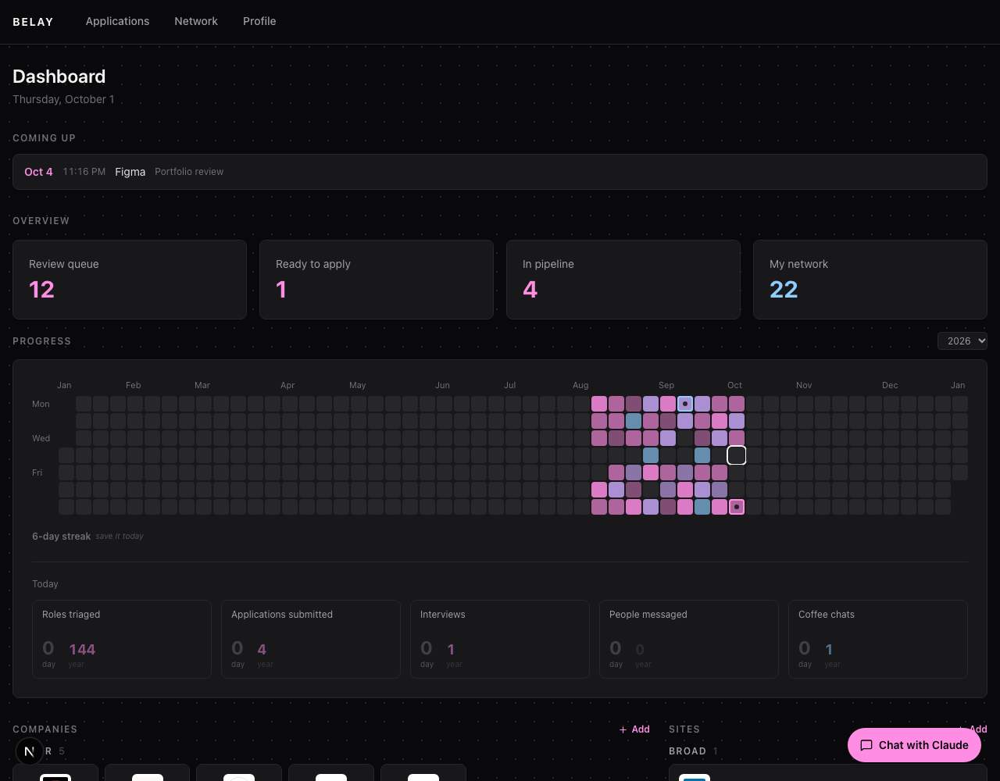
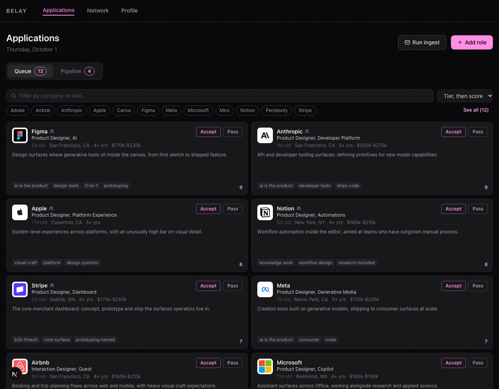
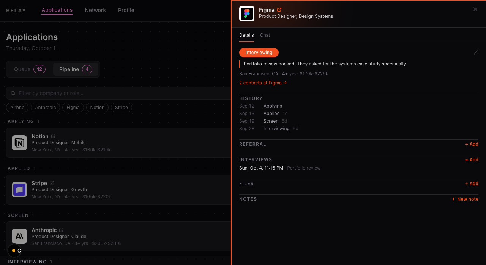
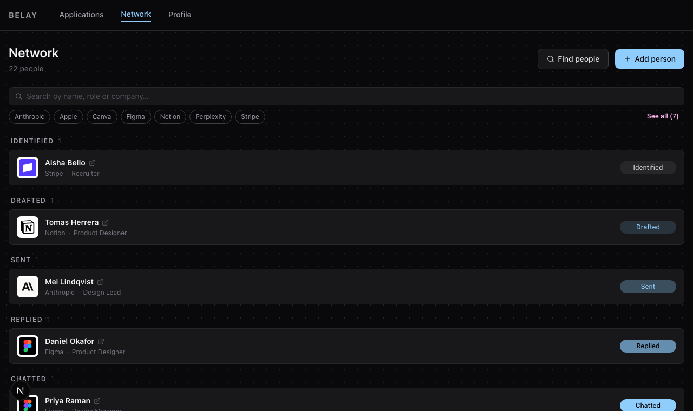

# Belay

*The rope that holds you while you climb.*

A job search that runs on your own machine. It finds the roles, helps you send the
applications, tracks what happens next, and works the people around the companies you
care about. One local SQLite file. No account, no server, nothing leaves your laptop.



---

## The queue

Roles arrive from the career pages of companies you track, from LinkedIn, from VC job
boards and from Gmail alerts. Each one is scored against criteria you write, compressed
to a headline and five tags, and handed to you two at a time.

Accept or pass with one key. When you pass, write why: those reasons feed back into the
scoring, so the queue gets quieter over time about the things you keep turning down.
Add a role the scan missed by pasting its URL.



## The pipeline

Every accepted role, grouped by stage. Move the chip to move the role.



Each role opens a panel holding its history with the gap in days between stages, who
could refer you, scheduled interviews, the files you sent, your notes, and a chat that
already knows the posting, your profile and your past verdicts.

## The network

The same shape, for people. Find designers at a company you track, record them, and
move them from identified through connected, replied and chatted. The chat drafts the
connect note, the follow-up, the scheduling message and the referral ask, with the
roles you are applying to already in context.



## The profile

Forty-one prompts: the durable answers every application form asks for, plus the
positioning, voice and search criteria that everything else reads. Filling these in is
what makes the scoring and the drafts useful, so start here.

---

## Running it

You need Node 20+ and [Claude Code](https://claude.com/claude-code) installed and signed
in (`claude` on your PATH). Every model call goes through it.

```bash
git clone https://github.com/colebiehle/belay
cd belay
npm install
npx prisma db push          # creates belay.db
npx tsx scripts/seed.ts     # the questions, blank
npm run dev                 # http://localhost:3001
```

Open `/profile` and answer what you can. Then add the companies you care about on the
dashboard, and press **Run ingest** on the Applications page to fill the queue.

To run the same scan every day at noon on macOS, run `bash scripts/daily-ingest.sh --install`.
It starts the dev server if it isn't running, and logs to `private/logs/`.

### Try it with example data first

```bash
DATABASE_URL=file:./demo.db npx prisma db push
DATABASE_URL=file:./demo.db npx tsx scripts/seed.ts
DATABASE_URL=file:./demo.db npx tsx scripts/demo.ts
DATABASE_URL=file:./demo.db npm run dev
```

That writes a sample search into a throwaway database, which is what the screenshots
above show. All of the data in it is fictional.

### Configuration

Copy `.env.example` to `.env`. Everything in it is optional.

Two ingest arms need credentials: a LinkedIn session cookie for the LinkedIn scan, and
Google credentials for the Gmail alert parser. Without them those two arms are skipped
and the rest of the scan runs normally.

The search filters all ship **off**, so a fresh install shows you everything. Set
`SEARCH_COMP_FLOOR_USD`, `SEARCH_MAX_YOE`, `SEARCH_LEVEL_EXCLUDE` and the rest to
narrow what reaches your queue. See `lib/search-config.ts` for what each one does.

## Your data

Everything lives in `belay.db`, a SQLite file in the project root. It is gitignored,
as is `.env`, so a public fork will not carry your data.

That covers those two files only. Anything else you add to the repo is tracked, so keep
resumes, notes and exports in the gitignored `private/` directory.

## Limitations

- **No authentication.** Belay is designed to run on `localhost`. Put an access layer
  in front of it before exposing it on a network.
- **Model calls are billed to you**, through your Claude Code subscription. Scoring a
  role takes seconds; the deep research routes take minutes.
- **The ingest arms depend on third-party job boards and ATS APIs**, which change
  without notice. A source that stops returning results needs its adapter updated in
  `lib/ats-boards.ts`.
- **LinkedIn profiles cannot be fetched.** Paste a person's background into their panel
  if you want the drafts to reference their actual work.

## Licence

MIT. Built by [Cole Biehle](https://colebiehle.com).
